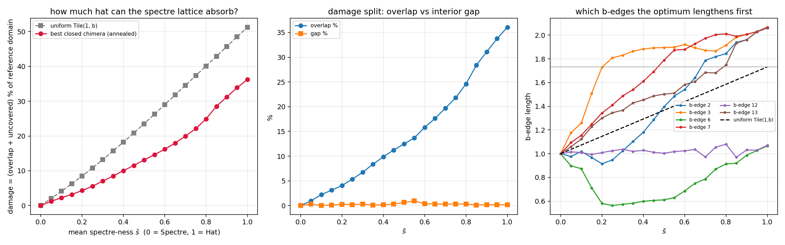
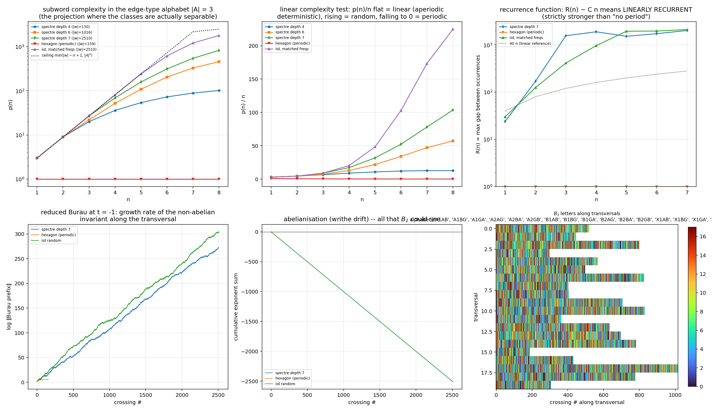
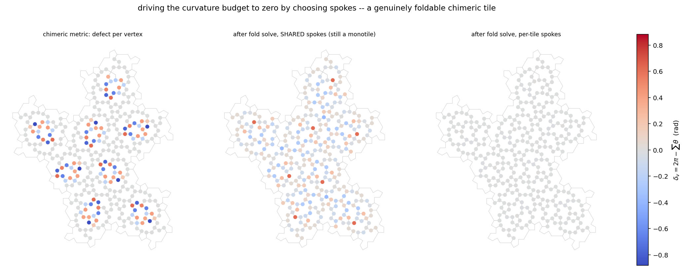
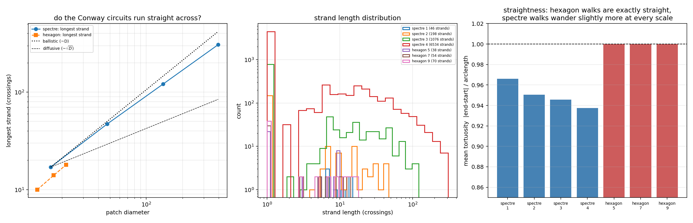
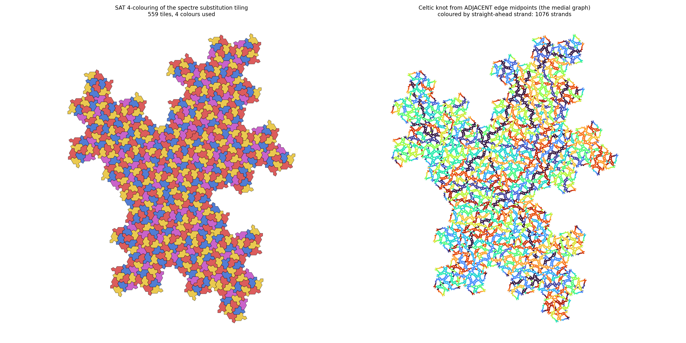

# einstein3d — new forms of the monotile (Spectre/Hat)

## The paper: *What a Substitution Determines, and What a Kernel Cannot Reach*

*Exact Spectral Theory of the Spectre Substrate, with a Lean 4 Checked Fact Layer.*

Build it with `make paper`; check everything with `make check`. The document is
**generated** — every number in it is a call into `spectrefacts.py` at build
time, so the paper cannot disagree with its own arithmetic. Editing the `.tex`
is editing a build artefact.

| | |
|---|---|
| `spectrefacts.py` | 44 Facts, computed exactly in sympy. `--selftest` checks all of them |
| `spectreatlas.py` | the contact atlas and X-charges, built from the placed tiling |
| `spectrelean.py`  | emits the Fact layer as Lean 4 and runs the kernel over it |
| `spectrepaper.py` | 13 sections, generated |

The Lean file is in the wiki: **[Spectre-Lean](https://github.com/brentharts/spectre/wiki/Spectre-Lean)**
— 44 theorems, Mathlib-free, no admitted proofs, and a *measured* axiom audit
(40 depend on no axioms at all; the 4 induction proofs use `propext` and
`Quot.sound`; `Classical.choice` appears nowhere, so every proof is
constructive).

### What the paper establishes

**The spectrum.** The substitution matrix has
χ(x) = x⁵(x−1)(x+1)(x²−8x+1), so the Perron eigenvalue is
λ² = 4+√15 ≈ 7.873 — the fundamental unit of ℤ[√15], since 4²−15·1² = 1. The
linear inflation factor λ = ½(√6+√10) splits into a hexagonal and a pentagonal
channel, (λ−λ⁻¹)² = 6 and (λ+λ⁻¹)² = 10, both proved in ℤ[√15] *without
evaluating a square root*.

**The zero sector is not semisimple.** rank M = 5 but rank Mⁿ = 4 for n ≥ 2:
one transient direction survives a single substitution and dies only after
two. The zero eigenvalue has algebraic multiplicity five and geometric
multiplicity four, so M is not diagonalizable.

**Two integer charges.** Q₊ and Q₋ are exact left eigenvectors for the marginal
eigenvalues ±1; Q₊ is conserved and Q₋ alternates, tracking global handedness
from species counts alone.

**The census, twice — and the identity between them.** Row Γ is all ones, so
N_Γ(n) is the *entire* census at depth n−1 and the Mystic is a second copy of
it. Hence **T_geom(n) = T(n) + T(n−1)**: 1, 8, 63, 496, 3905 against
1, 9, 71, 559, 4401. This was previously two conventions quoted in different
sections; it is now a theorem.

**Two phases, two quadratic fields.** The Hat runs on four metatiles with
χ_H(x) = (x−1)(x+1)(x²−7x+1) and inflation φ⁴ ≈ 6.854. The two characteristic
polynomials share (x−1)(x+1) and differ in **one coefficient** — seven against
eight — and that coefficient is the discriminant. The Spectre is graded by
ℚ(√15), the Hat by ℚ(√5). So the Spectre→Hat transition is not only a parity
restoration but a change of field, and the log-periodic fingerprint changes
with it.

**Aperiodicity, and which tile witnesses it.** All nine Spectre frequencies lie
in ℤ[√15] with nonzero √15 part, so *any* species refutes periodicity. The
Hat's commonest metatile has frequency exactly ⅓ — rational, and so no witness
at all.

**The contact atlas stabilises at 131 classes** (depths 3, 4, 5 *and* 6, none
gained or lost), so per-slot statements are statements about the infinite
tiling. The X-charges are deterministic and even:
X_Γ₂ = 14 (the Mystic is saturated), X_Γ₁ = X_Δ = X_Σ = 4, X_Λ = 2,
X_Φ ∈ {0,2}, and X_Θ = X_Π = X_Ξ = X_Ψ = 0.

**The flavour frequency is not converged.** p = Pr(Φ²) measured at depths
3–6 runs 0.683, 0.579, 0.538, 0.519 — still falling. The value near 0.58 is
what depth four gives, and earlier drafts quoted it as a limit. Repeated
Aitken extrapolation gives 0.5107 then 0.5035, so **if p → ½ then
ρ_X = 2g/(1+g) = 1 − √15/5 ≈ 0.2254**, a closed form in ℚ(√15). That is
evidence for one half, not a proof of it.

**Seifert minors, for every k at once.** The leading principal minors of the
(−2,1,1) tridiagonal form obey D_m = (−1)^m(m+1), proved by induction in Lean.
Sylvester then gives negative definiteness at *every* k rather than at sampled
ones, hence σ(T(2,k)) = −(k−1) and u(T(2,k)) = (k−1)/2.

**The measured chiral angle is the inflation factor.** Moritake *et al.* (2026,
[Nat. Commun. 17, 6085](https://doi.org/10.1038/s41467-026-75023-7)) fabricated
the Hat quasilattice and measured a chiral pinwheel diffraction pattern with
twist θ = arccos((3φ−1)/4) ≈ 15.52°. Since 3φ−1 = φ⁴−3, this is
**cos θ = (κ−3)/4** with κ the Hat inflation factor above: a laboratory
measurement and a Perron eigenvalue are one constant. Substituting the
Spectre's λ² gives a cosine greater than one, so the Spectre cannot share the
relation and must have its own angle in ℚ(√15) — a bench-scale test of the
two-field claim, with no cosmology involved.

### What it does not establish

Stated plainly, because the categories carry different obligations:

- **Not a computation.** The chirality-relaxation conjecture is a selection
  statement, not a dynamics.
- **Exact in principle, not computed here.** The Spectre's own chiral angle;
  the closed form for p.
- **Not determined by the data carried.** The deficit scale δ in the binding
  spectrum — Brittenham–Hermiller bound it (1 ≤ δ ≤ 4) and nobody has fixed
  it; the ratios {0,1,2,7} are ours, the scale is not. And the unit postulate
  behind the birefringence candidate, which is unjustified and is labelled so.
- **Obstructed by the transcription.** That the substitution matrix
  transcribes the published rules. Every Fact is downstream of it and none
  bears on it; the geometric census audits it, and an audit is not a proof.
  This is the one place the paper asks to be trusted.

A note on the last point, from the literature rather than from us: the
Brittenham–Hermiller theorem the binding mechanism rests on was corrected
after Wang and Zhang observed that two of its diagrams were a chiral knot and
its mirror. The theorem stands and now has two routes — but no proof layer
here would have caught that, because the question is about knot diagrams and
this kernel sees arithmetic. A machine-checked Fact layer is worth having and
does not insure against everything.


## Modules

### `tile_family.py` — per-edge Tile(a,b)
Removes the upstream limitation that (a,b) is a single parameter for the
whole tile. The 14-gon is decomposed into 14 fixed unit edge *directions*
plus a per-edge *length* vector. Facts established numerically:

* edge type sequence around the boundary: `aabbaabbaaaabb` (8 a-edges, 6
  b-edges; edges 9–10 are the collinear pair that makes the "straight" vertex)
* the a-edge unit vectors sum to zero, and the b-edge unit vectors sum to
  zero, **independently** — this is exactly why every uniform Tile(a,b)
  closes, and why per-edge mixtures generically fail to close. The closure
  defect is one of the measured quantities.

Per-edge and per-vertex "spectre-ness" s ∈ [0,1]: s=0 → Spectre scaling,
s=1 → Hat scaling (b-edges interpolate 1 → √3; a-edges are shared by both
families at length 1).

### `mixed_tiling.py` — Spectre/Hat mixtures + metrics
Places mixed tiles with the upstream substitution transformations, anchored
at canonical centroids, and measures the damage with shapely. Modes:
`spectre`, `hat`, `per_tile`, `per_edge`, `per_vertex`, `gradient`
(smooth spatial morph spectre→hat). Results at 2 iterations (71 tiles):

```
mode          overlap%    gap%  mean area  sd area  mean edge   closure
spectre          0.000   0.000     8.1962   0.0000     1.0000    0.0000
hat             35.121   1.140    13.8564   0.0000     1.3137    0.0000
per_tile        22.978   1.020    11.2256   2.8231     1.1679    0.0000
per_edge        21.507   2.640    10.7508   1.8721     1.1569    0.7683
per_vertex      21.313   1.550    10.7615   1.3438     1.1532    0.5645
gradient        22.950   0.789    11.2026   1.3431     1.1741    0.1069
```

Notes: the pure-spectre 0/0 row validates the pipeline. Pure hats on the
spectre lattice overlap ~35% because hat area (8√3 vs spectre 3√3+3 at
unit a) exceeds the spectre spacing. Per-edge mixing produces the largest
interior gap fraction; the gradient mode has the smallest closure defects
because neighbouring vertices carry nearly equal s.

The area of Tile(a,b) is exactly A = 2√3·a² + 3ab + √3·b², so
Spectre(1,1) = 3+3√3 ≈ 8.196, Hat(1,√3) = 8√3 ≈ 13.856 and
Turtle(√3,1) = 10√3 ≈ 17.321. Note A(a,b) ≠ A(b,a) — that asymmetry is
the Mystic, and it is why the Γ₂ = Tile(b,a) sweep in `multiplets.py`
splits Γ off the triplet.

### `braided_tiling.py` — first 3D form: edge braiding
Flat tiling; every *shared* edge between adjacent tiles is lifted into z as
two strands with opposite sinusoidal phase and opposite in-plane offset — a
2-strand braid with k crossings per edge (default 3). Strands are pinned to
z=0 at vertices so the weave rejoins the tiling at every corner; boundary
edges stay flat. At 1 iteration: 9 tiles, 40 shared edges, 46 boundary
edges → 120 crossings. Outputs a 3D render and `braided_tiles.obj`
(tile faces + ribbon strands) for Blender, complementing
`spectre_tiles_blender.py`. Flags: `--crossings`, `--height`, `--iterations`.

### `braid_words.py` — braid-group bookkeeping


Answer to "does aperiodicity force non-repeating braid words along
transversals": **empirically yes, at every scale tested.**

Construction: a transversal line reads a letter at each shared edge it
crosses — (edge type, which strand is on top at the crossing parameter),
alphabet {A±, B±, X±}. The over/under sign is fully geometric
(lexicographic edge orientation + centroid side + sin(πkt) phase), so words
are reproducible invariants of the tiling, not artifacts of insertion order.

Depth-4 tiling (4401 tiles, 27 540 shared edges), 148 transversals over 5
angles, word lengths 35–130:

* **0 of 148 words have any period** (exhaustive check of all p ≤ |w|/2);
  the identical machinery on a hexagon tiling returns period 1 immediately.
* Run-length (syllable) reduction of the words is also aperiodic — the
  non-repetition isn't hiding in trivial letter runs.
* Discovery en route: **~24 % of shared edges pair an a-type edge with a
  b-type edge** (6 635/27 540). Legal for the Spectre because a=b makes all
  edge lengths equal — and it is precisely these X-pairings that turn into
  1-vs-√3 mismatches under per-edge hat scaling, explaining the gap
  structure measured in `mixed_tiling.py`.
* Caveat: subword complexity p(n) saturates near |w| at these word lengths,
  so the linear-vs-exponential complexity class isn't resolved yet — needs
  depth-5 transversals (words of ~350+ letters). The periodicity result is
  the definitive statement at this sample size.


---
### `chirality_e8.py` — quantifying the spectre ↔ E8 (G.~Lisi 2007) analogy


Motivated by Distler–Garibaldi (E8 cannot host three chiral generations
without mirror fermions) vs the spectre being the first strictly chiral
aperiodic monotile. Computed:

* **Chirality census: χ = (N_R−N_L)/N = ±1 at every iteration** (9, 71,
  559, 4401 tiles). Not a single mirror tile appears anywhere in the
  tiling at any scale — the substitution realizes the spectre's strict
  chirality exactly. This is the quantitative statement of "the geometry
  has no mirror partner", the property E8 representation theory cannot
  provide. Mystic fraction locks to 11.27 % (= Gamma frequency).
* **E8 side verified**: the 240 roots on the Coxeter plane fall on 8
  circles of 30, whose radii pair in the golden ratio to 9 decimal places
  (4 φ-pairs) — the honest quantitative bridge between E8 and
  quasicrystal geometry (Elser–Sloane territory).
* **Algebraic comparison**: λ² = 4+√15 exactly, and √15 = √3·√5 — the
  spectre eigenvalue mixes the hexagonal field with the golden field, but
  λ ∉ Q(√5): the spectre is in a different quasicrystal class than
  E8/H4/Penrose (λ sits between the silver and bronze means). Any theory
  wiring the spectre into E8 machinery has to bridge Q(√3·√5) ↔ Q(√5).
* **Tile-species spectrum** (Perron eigenvector of the substitution
  matrix, eigenvalue 4+√15): frequencies organize into degenerate
  multiplets — {Φ}=0.2218, {Ψ}=0.1754, {Σ,Γ,Δ}=0.1270 (triplet!),
  {Π,Ξ}=0.0948 (doublet), {Θ,Λ}=0.0161 (doublet). Nine species, five
  levels — the tiling's own "particle spectrum with degeneracies".
* **Mass-ratio scan, with trials accounting** (the standard Kletetschka's
  three-time mass claims should meet too): 780 candidates n·λ^k at 0.5 %
  tolerance produce 3 hits (best: 20λ⁵ ≈ m_τ/m_e at 0.033 %) against an
  expected ~3.1 chance matches. Verdict: numerology at exactly the
  chance rate — reported so the negative result is on record.


---
## `multiplets.py` — degeneracy structure and what breaks it


### Exact spectrum (sympy, Q(√15); g = 4−√15 = 1/λ²)
All five levels are exact, with closed forms:

```
0.221767  {Φ}        = −54+14√15 = 2g(1−g)
0.175416  {Ψ}        =  97−25√15
0.127017  {Γ,Δ,Σ}    =  g  = 1/λ²
0.094750  {Π,Ξ}      = −58+15√15
0.016133  {Θ,Λ}      =  g² = 1/λ⁴
```

### Provenance of each degeneracy (three different mechanisms!)
* **{Γ,Δ,Σ} — conservation law.** Rows of the substitution matrix are
  identical (all-ones): every supertile of every type contains exactly one
  Γ, one Δ, one Σ.
* **{Θ,Λ} — conditional.** Row Θ = indicator of Γ, row Λ = indicator of
  Σ, so v_Θ = v_Γ/λ², v_Λ = v_Σ/λ². Holds iff the triplet holds AND the
  indicator rows are intact.
* **{Π,Ξ} — the −1 eigenvalue.** The automorphism group of M is TRIVIAL
  (verified over all 9! permutations), so no *permutation* symmetry protects
  this one — but it is not accidental either. The counts satisfy
  Ξₙ − Πₙ = ±1 exactly, forever: writing w = e_Ξ − e_Π, one checks
  w·M³ = −w·M², so the difference functional lands in the eigenspace of the
  (λ+1) factor of the characteristic polynomial λ⁵(λ−1)(λ+1)(λ²−8λ+1). The
  frequencies are equal because a −1-eigendirection stays bounded while the
  total grows like λ²ⁿ. It is still fragile: a generic perturbation moves that
  eigenvalue off −1, which is exactly what the susceptibility table below
  shows.

### Which degeneracies survive deformation
Splitting susceptibilities |d(v_i−v_j)/dε| over 400 random perturbations
M+εB per ensemble (median):

```
ensemble        Γ−Δ       Δ−Σ       Θ−Λ       Π−Ξ
generic         1.3e−02   1.3e−02   1.2e−02   1.3e−02   (all split)
conservation    ~1e−10    ~1e−10    1.4e−02   2.2e−02
indicator       ~1e−10    ~1e−10    ~1e−11    1.3e−02   (Π−Ξ still splits)
```

Geometric **mystic-axis** sweep r = b/a ∈ [1, √3] (spectre→hat), area
fractions f_i(r) = v_i·A_i(r) with Γ = Γ₁+Γ₂ and the Mystic Γ₂ = Tile(b,a),
using A(a,b) ≠ A(b,a) (hat 8√3 vs turtle 10√3):

```
max |f_Γ − f_Δ| over sweep = 0.137   (Γ splits off immediately)
max |f_Δ − f_Σ| = |f_Θ − f_Λ| = |f_Π − f_Ξ| = 0.000000 (exact survival)
```

Empirical cross-check: per-species mean areas under random per-edge mixing
are flat within errors (10.3–12.0 ± ~1.6) — the geometry carries no hidden
species dependence.

### The physics-shaped summary
The 1+1+3+2+2 pattern is held together by **three inequivalent mechanisms
with a strict protection hierarchy**, and the two natural deformation axes
break it in orthogonal ways:

* geometric deformation (per-edge spectre→hat, acting through the Mystic)
  splits ONLY Γ out of the triplet: 3 → 2+1, everything else exact;
* combinatorial deformation splits the accidental {Π,Ξ} doublet FIRST, at
  first order, in every ensemble — while conservation-respecting
  deformations leave {Δ,Σ} and {Θ,Λ} untouched to machine precision.

That is a symmetry-breaking cascade with a "protected isospin-like"
sector and a fragile accidental sector — the structurally honest version of
a mass-splitting story, derived rather than fitted. Next steps: (1) find the deformed tiling whose substitution matrix realises
the combinatorial perturbation (does per-edge mixing at the metatile level
change supertile contents?), and (2) second-order splittings of the
protected pairs.

---


---
## `closure_repair.py` --- closed chimeric tiles, and how much hat the lattice absorbs




Closure of the 14-gon is exactly two linear constraints on the length vector,
`A L = 0` with `A = U^T`, so the nearest closed length vector to any desired
mixture is an orthogonal projection. Two weightings are implemented: spread
the correction over all 14 edges, or pin the a-edges at 1 and make the
b-edges pay. Both take the closure defect of random per-edge mixing from
**0.77 to 1e-16**:

```
mode            repair     closure   overlap%    gap%  mean|dL|   a-part   b-part
per_edge        raw       8.60e-01     28.72    7.17    0.0000   0.0000   0.0000
per_edge        free      6.26e-16     28.28    3.00    0.0774   0.0748   0.0810
per_edge        pinned_a  6.94e-16     25.86    2.71    0.0781   0.0000   0.1822
per_vertex      raw       7.12e-01     27.08    4.27    0.0000   0.0000   0.0000
per_vertex      pinned_a  5.62e-16     25.42    1.89    0.0638   0.0000   0.1489
```

Better than repairing: with a-edges pinned, closure is a 2x6 system on the
b-edges, whose solution set is an **exactly closed 4-parameter family**
`L_b(c) = 1 + N c`, `N = null(A_b)`. Every member closes by construction.

Two corrections to the existing pipeline were needed to get here:

* `tile_family.UNIT_DIRS` is derived from the float32 vertex table in
  `spectre.py`, which caps closure defects at ~1e-8. Every edge direction is
  an exact multiple of 30 degrees, so snapping recovers full float64.
  Exported as `closure_repair.UNIT_DIRS`.
* **`mixed_tiling.measure` has a gap-metric loophole.** It reports gaps as
  the interior *holes* of the union, so a tiling of shrunken, mutually
  disjoint tiles scores as gap-free --- the union is then a MultiPolygon with
  no interior rings at all. Annealing found this immediately and drove every
  b-edge below 1. `measure_in_domain` instead measures overlap and uncovered
  area against a fixed reference domain (the eroded spectre union). With
  that, the unconstrained optimum correctly returns to `b = 1`: the spectre
  is the unique damage-free member of the family.

**Absorption capacity** --- anneal the closed family at fixed mean
spectre-ness `s_bar` and ask when the damage crosses a budget:

```
damage budget    closed chimera    uniform Tile(1,b)    gain
     2%            s_bar = 0.096      s_bar = 0.049     x1.96
     5%            s_bar = 0.228      s_bar = 0.120     x1.89
    10%            s_bar = 0.400      s_bar = 0.233     x1.72
```

Closed chimeras absorb about **twice** as much hat as uniform Tile(1,b) at
every budget. The optimum does not raise the b-edges uniformly --- it splits
them into growers and shrinkers, some going past sqrt(3) while others drop
below 1.

---
## `bezier_tiling.py` --- the curved monotile, hooked into the substitution

`bezier_spectre.py` (forked from Jan-Piotraschke/spectre-monotile-py) draws
one curved tile and was never wired into the tiler, so the only interesting
question about it was unasked: does the curved tile still tile? It does, and
the reason connects straight back to `chirality_e8.py`.

For edge `p->q` with `d = q-p`, `m = (p+q)/2`, `n = J d` (`J` = rotate -90),
the controls are `m -+ c n`. `P0,P3` and `P1,P2` are each swapped by the point
reflection about `m`, so the cubic is invariant under it and the neighbour's
copy lands on the same point set --- **provided both tiles have the same
handedness**, because `J` anticommutes with reflections (`M J = -J M`).
Every substitution placement has `det T = +1`, so:

* max curved mating error at `c = 0.12`: **2.3e-06**, which is exactly the
  `c = 0` baseline (the float32 vertex table), not the curve construction
* mirror a single tile and it jumps to **5.73**, a factor of 2.5e6
* the curved tiling's overlap and interior-hole fractions stay at 1e-5 % for
  every `c` tested

So the curved tiling inherits gap-freeness from strict chirality.

Also measured:

* **area is exactly invariant** under curving --- 1.0000000000 to ten decimals
  for Spectre, Hat and Turtle at every `c`, because the two lobes of each
  point-symmetric S-curve cancel. Perimeter grows, so `c` is a pure
  isoperimetric-ratio knob at fixed area *and* fixed tiling
  (`Q = 4 pi A / P^2`: 0.5255 at `c=0` -> 0.3739 at `c=0.5`).
* critical curve strengths, bracketed by bisection:

```
                    self-intersection c*    tiling collision c*
Spectre(1,1)               1.96408                2.12329
Hat(1,sqrt3)               1.39362                n/a (overlaps already at c=0)
Turtle(sqrt3,1)            1.39362                n/a
chimera s_bar=0.25         1.73346                n/a
chimera s_bar=0.50         1.57590                n/a
```

  Self-intersection of a single tile bites before tile-tile collision, so the
  curved Spectre family is valid exactly on `|c| < 1.964`.

---
## `braid_words_bn.py` --- B_n bookkeeping, and the depth-7 complexity answer




Two gaps in `braid_words.py` are closed here.

**(a) B_2 is abelian.** The {A+-, B+-, X+-} reading is a 2-strand braid, and
`B_2 = Z`, so the only group-theoretic content of a transversal word was its
writhe. Generalise the weave to an **n-strand cable**: strands at angles
`2 pi j / n` on a circle of radius `r sin(pi t)` (pinned at both vertices),
the circle rotating by `pi k t` along the edge. Each shared edge then carries
the Garside half-twist `Delta^k` in `B_n`. Verified by simulation rather
than assumed --- the crossing count is exactly `k n(n-1)/2` for n = 2,3,4,5,
and the induced permutation is the full reversal for odd k.

**n = 3 is literally "B_3 with the tile boundary as a third strand"**: strand
0 is the copy of the shared edge from the tile on the positive side of the
normal, strand 1 is the other tile's copy, strand 2 is the flat tile boundary
lifted into the weave. n = 2 recovers the old alphabet exactly (`floor(k t)`
parity is the same reading rule), so the six letters {A+-, B+-, X+-} are a
special case.

**(b) p(n) saturation.** A streaming transversal extractor keeps only edges
that actually cross the line, so depth 6 (272 791 tiles) and depth 7
(2 147 679 tiles) are reachable. Longest word: **2510 letters** at depth 7,
against 35..130 before.

Results over 40 transversals at depths 4 and 6 plus the depth-7 word:

* **0 words have any period**, letters or run-length syllables, at every
  depth --- the original result, now at 20x the word length
* the full 18-letter alphabet saturates `p(n)` by n = 4 just as before, so
  the complexity question has to be asked in the **edge-type projection**
  {a, b, x}, where a 2510-letter word resolves `p(n)` out to n = 8:

```
word                          |w|   p(1)  p(2)  p(3)  p(4)  p(5)  p(6)  p(7)  p(8)
spectre depth 4               130      3     9    20    36    54    73    89   102
spectre depth 6              1016      3     9    22    52   109   205   330   459
spectre depth 7              2510      3     9    27    69   159   314   547   829
hexagon (periodic)            159      1     1     1     1     1     1     1     1
iid, matched freqs           2510      3     9    27    81   242   618  1215  1799
ceiling min(|w|-n+1, 3^n)              3     9    27    81   243   729  2187  2502
```

  The iid control is matched to the tiling's own letter frequencies
  (a/b/x = 48.2 / 28.9 / 23.0 %), since non-uniform frequencies alone depress
  `p(n)`. The spectre word contains **every** triple (p(3) = 27 = 3^3), so it
  is not low-complexity either; it separates from random at n = 4 and the
  ratio falls monotonically to 0.45.
* entropy estimate `h(n) = log p(n) / n` leaves `log 3 = 1.0986` at n = 4 for
  the spectre and only at n = 6 for the matched random control:

```
spectre depth 7            1.099 1.099 1.099 1.059 1.014 0.958 0.901 0.840
iid, matched freqs         1.099 1.099 1.099 1.099 1.098 1.071 1.015 0.937
hexagon (periodic)         0.000 0.000 0.000 0.000 0.000 0.000 0.000 0.000
```

  **Honest verdict**: the growth is measurably sub-random and super-linear at
  every window measured, and the fitted exponent climbs with depth
  (2.86 at depth 6, 3.32 at depth 7) --- consistent with polynomial complexity
  of a 2D cut, not with the linear `p(n)` of a 1D substitution. It is *not*
  converged: a power-law fit over so short a window does not by itself
  separate the classes, since the random control admits one too. This is a
  sharper statement than the depth-4 caveat, not a resolution of it.
* non-abelian invariants of the depth-7 word: image in `S_3` = identity,
  writhe = -2510 (the cable twist handedness is globally consistent, which is
  itself a consequence of chirality), reduced Burau at `t = -1` growing with
  Lyapunov exponent 0.1083 per crossing
* the `a|b` mixed-edge fraction along the deep transversal is **22.95 %**,
  consistent with the 24.1 % that `braid_words.py` measured over the whole
  depth-4 tiling

`cabled_patch` / `export_obj` extend `braided_tiling.py` to n strands and
write `braid_cable.obj`.

---
## `folding_defect.py` --- curvature budget and chimeric tiles that fold




The obstacle first: **every interior angle of Tile(a,b) is independent of a
and b**. The 14 edge directions are fixed and only lengths change, so the
corner angles are

```
90  240  90  120  270  120  90  120  270  120  180  120  90  240   (deg, sum 2160)
```

for every member of the family --- the 180 at corner 10 is the straight
vertex. Swapping spectre b-edges for hat b-edges moves no angle at all, every
vertex star still sums to 2 pi, and the naive angular defect of a chimeric
tiling is identically zero. Per-edge lengths look like no knob whatsoever.

They become one as soon as the tile is a piecewise-flat **metric** disc
rather than a rigid polygon. Fan-triangulate from the centroid: 14 triangles
with boundary lengths `L_i` and spokes `r_i`. Corner angles now depend on
`(L, r)`; adjacent tiles are forced to share one length per tiling edge (the
mean of what the two tiles want), so the chimeric incompatibility surfaces as
**discrete Gaussian curvature** `delta_v = 2 pi - sum(angles at v)` instead of
as a gap. That is the 3D translation of `closure_repair.py`.

Census of the depth-2 patch (71 tiles, 524 vertices, 331 interior):

* **31 distinct interior vertex-star types**, valences 2 to 4, and every one
  of them sums to exactly 360.0000 degrees
* the pure spectre metric is flat to **6.2e-15 rad**, net curvature -1.4e-13
* the complex has `chi = -1` and three boundary loops, but the two extra
  loops enclose **zero area** (union area == sum of tile areas exactly). They
  are an artifact of the tiling not being vertex-to-vertex --- the 180-degree
  corner lets a vertex sit inside a neighbour's edge. This is why the
  boundary-turning form of Gauss-Bonnet does not reduce to 2 pi for a patch.

Curvature budget vs mean spectre-ness:

```
 s_bar   mismatch  sum|delta|  max|delta|  sum|d| rand   net curv
  0.00     0.0000      0.0000      0.0000      34.0777    -0.0000
  0.25     0.0501     30.9875      0.5225      60.4848    -2.5533
  0.50     0.1002     50.5040      0.8812      76.2175    -4.4789
  0.75     0.1504     58.6281      1.0264      80.4193    -4.6634
  1.00     0.2005     65.9157      1.1704      75.7591    -5.5527
```

The budget is nearly balanced (net curvature stays small against a total
absolute curvature of 50-66 rad), so hat-ness buys **saddles and cones in
roughly equal measure**, not a global cone.

**The fold solve.** Choose spokes to drive every interior defect to zero, at
`s_bar = 0.5` (rms defect 0.294 rad, max 0.881 before):

```
shared spokes  (14 params -- the result is still a MONOTILE)   rms 0.160 rad
per-tile spokes (994 params)                                   rms 0.0058 rad
```

So a chimeric spectre patch **can** be made to fold flat if each tile is
allowed its own spoke vector, but a single shared chimeric metatile only
halves the defect --- the 14 spokes cannot satisfy 331 constraints coming from
31 distinct star types. That is a concrete obstruction, not a failure of the
solver.

**Gauss-Bonnet, closed-surface form.** Prescribing the whole `4 pi` of a
sphere on 12 cone points (`pi/3` each, the football) and solving for spokes:
achieved total curvature **12.5664 = 4 pi exactly, residual rms 0.000000 rad**.
The metric carries a sphere's worth of curvature on twelve vertices and is
flat everywhere else. `embed_3d` then realises that metric in R^3 by stress
minimisation (rms edge-length error 0.033) and writes `folded_tiling.obj`.


---
## `knot_colors.py` --- SAT colouring of the spectre tiling, and its Celtic knot




Hooks `einstein_knots_colors.py` into the substitution tiler. Upstream
four-colours its own H7/H8 hat construction and draws a Celtic knot from
*random* chords inside each tile, so the colouring was never applied to the
spectre substitution tiling and the knot had no invariants.

**Chromatic number.** `einstein_knots_colors.four_color_sat` is generalised
to `k_color_sat` and run for k = 3 and 4 on the edge-adjacency graph:

```
 depth   tiles  adjacencies  3-colourable  4-colourable  chi
     1       9           14          True          True    3
     2      71          150         False          True    4
     3     559         1309         False          True    4
     4    4401        10955         False          True    4
```

So four colours are not merely sufficient (which the four colour theorem
already guarantees) but **necessary** from depth 2 onward. The obstruction is
not the obvious one: there is **no K4 anywhere in the edge-adjacency graph**,
so a fourth colour is forced by odd-cycle structure rather than by a clique.
Under the looser vertex-touching adjacency the chromatic number is also 4.

**The Celtic knot.** Pairing *adjacent* edge midpoints instead of random ones
makes the curve canonical: it is the medial graph of the tiling, 4-valent at
every interior edge midpoint, and its components are the straight-ahead walks
(Conway circuits) --- the same objects that become strands in the cabled weave
of `braid_words_bn.py`.

Two things had to be got right for the decomposition to be a decomposition:

* at a 4-valent crossing the strand takes the arc **opposite in cyclic
  order**, not merely the least-turning one. A least-turn rule is not
  injective --- two incoming arcs can both prefer the same outgoing arc --- so
  it does not partition the medial graph at all. Sorting the four arc-ends
  by angle and pairing i with i+2 gives a perfect matching.
* a strand **stops** at a midpoint of degree < 4. Those are boundary edges of
  the finite patch, where the walk would continue into a missing tile;
  letting it turn there manufactures spurious closed circuits (a naive
  tracer reports one big fake circuit for the hexagon control).

With both fixed, the arc coverage is exact at every depth (sum of strand
lengths == 14 * n_tiles), so this really is a partition:

```
    kind  depth   tiles  crossings     diam  closed  strands  mean len  max len  tortuosity
 spectre      1       9         86     16.1       0       46      2.74       17      0.9661
 spectre      2      71        596     47.2       0      198      5.02       47      0.9505
 spectre      3     559       4451    137.9       0     1076      7.27      121      0.9456
 spectre      4    4401       34074    395.8       0     6534      9.43      307      0.9374
 hexagon      5      25         94     12.4       0       38      3.95       10      1.0000
 hexagon      7      49        174     17.0       0       54      5.44       14      1.0000
 hexagon      9      81        278     21.6       0       70      6.94       18      1.0000
```

* **no closed circuits at any depth** --- every straight-ahead walk of a finite
  spectre patch runs off the boundary
* the hexagon control returns tortuosity **exactly 1.0000**, i.e. its walks are
  straight lines, which validates the tracer
* spectre tortuosity drifts steadily **down** with scale
  (0.9661 -> 0.9505 -> 0.9456 -> 0.9374): the circuits wander a little more
  the further you follow them
* the longest strand scales as `diameter^0.90` (1.0 ballistic, 0.5 diffusive),
  so the circuits are **near-ballistic but not straight** --- they cross the
  patch, but on a slowly wandering path

**Colour words.** Each strand of a cable belongs to one of the two tiles at a
shared edge, so it inherits that tile's SAT colour and the transversal braid
word acquires a colour word. Over 59 transversals (lengths 15..48) none has a
period. Reported with the caveat it deserves: the colouring is one SAT
solution among many, so unlike the edge-type word this is a property of the
particular colouring, not a tiling invariant.


---

Python script for generating tilings of the weakly chiral aperiodic monotile Tile(1,1) "Spectre".
Code ported from JavaScript from the web app [1] provided [2] by the authors of the original research paper [3].

[1]: https://cs.uwaterloo.ca/~csk/spectre/app.html

[2]: https://cs.uwaterloo.ca/~csk/spectre/

[3]: https://arxiv.org/abs/2305.17743


* USAGE

    * When drawing with drowsvg the command is : 
       ```python spectre_tiles_drow.py```
    * When drawing with mathplot.plot, the command is : 
       ```python spectre_tiles_plot.py```
    * When print symbolic points and transforms with sympy, the command is : 
       ```python symSpectre.py```
    * when customization;
        To ensure that the same pattern is visible no matter which command you use to draw the spectre tile,
        the customization related to the drawing is embedded in the ```spectre.py```

* CHANGES

    * Made it possible to compare the drawing speed between the path drawing process of all polygons by mathplotlib and the two polygon reference processes via transform by drowsvg.
    * Made it possible to draw spectre tile(edge_a, edge_b) at any ratio.
    * split mathplot.plot and drowsvg
    * In order to reduce the size of the SVG file, 
      the Transform of DrawSVG replaced the matrix with 6 floating-point numbers 
      with a translate with 2 floating-point numbers and a rotate and scale expansion with 3 integers. 
   * Added a function to print symbolic points and transforms with sympy.


