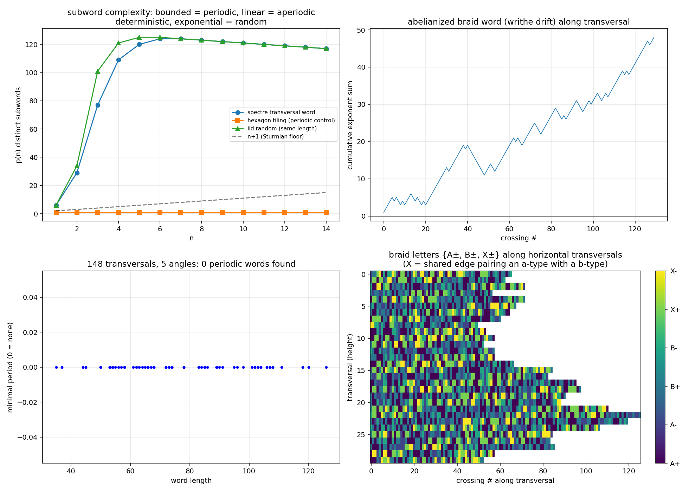
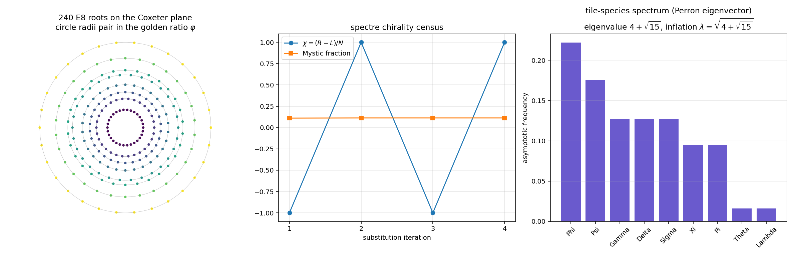
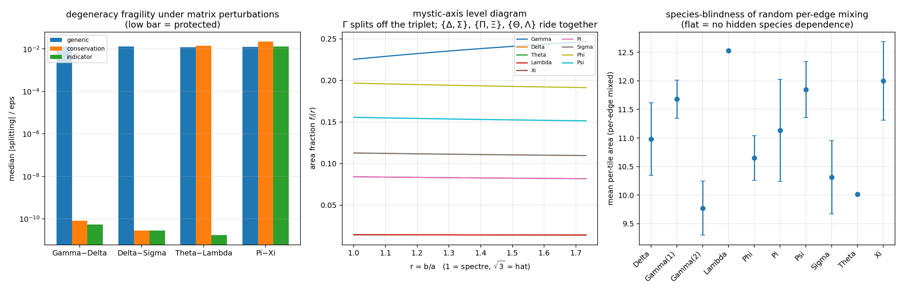

# einstein3d — new forms of the Einstein tile (Spectre / Hat)

Builds on the cloned repos `brentharts/spectre` (substitution tiler),
`brentharts/spectre-monotile-py` (Tile(a,b) generator), and
`brentharts/nariai` (LIGO scripts). Place this folder next to those clones.

## Modules

### `tile_family.py` — per-edge Tile(a,b)
Removes the upstream limitation that (a,b) is a single parameter for the
whole tile. The 14-gon is decomposed into 14 fixed unit edge *directions*
plus a per-edge *length* vector. Facts established numerically:

* edge type sequence around the boundary: `aabbaabbaaaabb` (8 a-edges, 6
  b-edges; edges 9–10 are the collinear pair that makes the "straight" vertex)
* the a-edge unit vectors sum to zero, and the b-edge unit vectors sum to
  zero, **independently** — this is exactly why every uniform Tile(a,b)
  closes, and why per-edge mixtures generically fail to close. The closure
  defect is one of the measured quantities.

Per-edge and per-vertex "spectre-ness" s ∈ [0,1]: s=0 → Spectre scaling,
s=1 → Hat scaling (b-edges interpolate 1 → √3; a-edges are shared by both
families at length 1).

### `mixed_tiling.py` — Spectre/Hat mixtures + metrics
Places mixed tiles with the upstream substitution transformations, anchored
at canonical centroids, and measures the damage with shapely. Modes:
`spectre`, `hat`, `per_tile`, `per_edge`, `per_vertex`, `gradient`
(smooth spatial morph spectre→hat). Results at 2 iterations (71 tiles):

```
mode          overlap%    gap%  mean area  sd area  mean edge   closure
spectre          0.000   0.000     8.1962   0.0000     1.0000    0.0000
hat             35.121   1.140    13.8564   0.0000     1.3137    0.0000
per_tile        22.978   1.020    11.2256   2.8231     1.1679    0.0000
per_edge        21.507   2.640    10.7508   1.8721     1.1569    0.7683
per_vertex      21.313   1.550    10.7615   1.3438     1.1532    0.5645
gradient        22.950   0.789    11.2026   1.3431     1.1741    0.1069
```

Notes: the pure-spectre 0/0 row validates the pipeline. Pure hats on the
spectre lattice overlap ~35% because hat area (4√3+6 vs spectre 3√3+3 per
unit a) exceeds the spectre spacing. Per-edge mixing produces the largest
interior gap fraction; the gradient mode has the smallest closure defects
because neighbouring vertices carry nearly equal s. Exact areas:
Spectre(1,1) = 3+3√3 ≈ 8.196, Hat(1,√3) = 6+4√3... (measured 13.856).

### `braided_tiling.py` — first 3D form: edge braiding
Flat tiling; every *shared* edge between adjacent tiles is lifted into z as
two strands with opposite sinusoidal phase and opposite in-plane offset — a
2-strand braid with k crossings per edge (default 3). Strands are pinned to
z=0 at vertices so the weave rejoins the tiling at every corner; boundary
edges stay flat. At 1 iteration: 9 tiles, 40 shared edges, 46 boundary
edges → 120 crossings. Outputs a 3D render and `braided_tiles.obj`
(tile faces + ribbon strands) for Blender, complementing
`spectre_tiles_blender.py`. Flags: `--crossings`, `--height`, `--iterations`.

### `braid_words.py` — braid-group bookkeeping



Answer to "does aperiodicity force non-repeating braid words along
transversals": **empirically yes, at every scale tested.**

Construction: a transversal line reads a letter at each shared edge it
crosses — (edge type, which strand is on top at the crossing parameter),
alphabet {A±, B±, X±}. The over/under sign is fully geometric
(lexicographic edge orientation + centroid side + sin(πkt) phase), so words
are reproducible invariants of the tiling, not artifacts of insertion order.

Depth-4 tiling (4401 tiles, 27 540 shared edges), 148 transversals over 5
angles, word lengths 35–130:

* **0 of 148 words have any period** (exhaustive check of all p ≤ |w|/2);
  the identical machinery on a hexagon tiling returns period 1 immediately.
* Run-length (syllable) reduction of the words is also aperiodic — the
  non-repetition isn't hiding in trivial letter runs.
* Discovery en route: **~24 % of shared edges pair an a-type edge with a
  b-type edge** (6 635/27 540). Legal for the Spectre because a=b makes all
  edge lengths equal — and it is precisely these X-pairings that turn into
  1-vs-√3 mismatches under per-edge hat scaling, explaining the gap
  structure measured in `mixed_tiling.py`.
* Caveat: subword complexity p(n) saturates near |w| at these word lengths,
  so the linear-vs-exponential complexity class isn't resolved yet — needs
  depth-5 transversals (words of ~350+ letters). The periodicity result is
  the definitive statement at this sample size.


---
### `chirality_e8.py` — quantifying the spectre ↔ E8 (G.~Lisi 2007) analogy



Motivated by Distler–Garibaldi (E8 cannot host three chiral generations
without mirror fermions) vs the spectre being the first strictly chiral
aperiodic monotile. Computed:

* **Chirality census: χ = (N_R−N_L)/N = ±1 at every iteration** (9, 71,
  559, 4401 tiles). Not a single mirror tile appears anywhere in the
  tiling at any scale — the substitution realizes the spectre's strict
  chirality exactly. This is the quantitative statement of "the geometry
  has no mirror partner", the property E8 representation theory cannot
  provide. Mystic fraction locks to 11.27 % (= Gamma frequency).
* **E8 side verified**: the 240 roots on the Coxeter plane fall on 8
  circles of 30, whose radii pair in the golden ratio to 9 decimal places
  (4 φ-pairs) — the honest quantitative bridge between E8 and
  quasicrystal geometry (Elser–Sloane territory).
* **Algebraic comparison**: λ² = 4+√15 exactly, and √15 = √3·√5 — the
  spectre eigenvalue mixes the hexagonal field with the golden field, but
  λ ∉ Q(√5): the spectre is in a different quasicrystal class than
  E8/H4/Penrose (λ sits between the silver and bronze means). Any theory
  wiring the spectre into E8 machinery has to bridge Q(√3·√5) ↔ Q(√5).
* **Tile-species spectrum** (Perron eigenvector of the substitution
  matrix, eigenvalue 4+√15): frequencies organize into degenerate
  multiplets — {Φ}=0.2218, {Ψ}=0.1754, {Σ,Γ,Δ}=0.1270 (triplet!),
  {Π,Ξ}=0.0948 (doublet), {Θ,Λ}=0.0161 (doublet). Nine species, five
  levels — the tiling's own "particle spectrum with degeneracies".
* **Mass-ratio scan, with trials accounting** (the standard Kletetschka's
  three-time mass claims should meet too): 780 candidates n·λ^k at 0.5 %
  tolerance produce 3 hits (best: 20λ⁵ ≈ m_τ/m_e at 0.033 %) against an
  expected ~3.1 chance matches. Verdict: numerology at exactly the
  chance rate — reported so the negative result is on record.


---
## `multiplets.py` — degeneracy structure and what breaks it




### Exact spectrum (sympy, Q(√15); g = 4−√15 = 1/λ²)
All five levels are exact, with closed forms:

```
0.221767  {Φ}        = −54+14√15 = 2g(1−g)
0.175416  {Ψ}        =  97−25√15
0.127017  {Γ,Δ,Σ}    =  g  = 1/λ²
0.094750  {Π,Ξ}      = −58+15√15
0.016133  {Θ,Λ}      =  g² = 1/λ⁴
```

### Provenance of each degeneracy (three different mechanisms!)
* **{Γ,Δ,Σ} — conservation law.** Rows of the substitution matrix are
  identical (all-ones): every supertile of every type contains exactly one
  Γ, one Δ, one Σ.
* **{Θ,Λ} — conditional.** Row Θ = indicator of Γ, row Λ = indicator of
  Σ, so v_Θ = v_Γ/λ², v_Λ = v_Σ/λ². Holds iff the triplet holds AND the
  indicator rows are intact.
* **{Π,Ξ} — accidental.** The automorphism group of M is TRIVIAL
  (verified over all 9! permutations). Equality is nevertheless exact,
  hinging on the identity v_Φ = 2(v_Γ − v_Θ). No symmetry protects it.

### Which degeneracies survive deformation
Splitting susceptibilities |d(v_i−v_j)/dε| over 400 random perturbations
M+εB per ensemble (median):

```
ensemble        Γ−Δ       Δ−Σ       Θ−Λ       Π−Ξ
generic         1.3e−02   1.3e−02   1.2e−02   1.3e−02   (all split)
conservation    ~1e−10    ~1e−10    1.4e−02   2.2e−02
indicator       ~1e−10    ~1e−10    ~1e−11    1.3e−02   (Π−Ξ still splits)
```

Geometric **mystic-axis** sweep r = b/a ∈ [1, √3] (spectre→hat), area
fractions f_i(r) = v_i·A_i(r) with Γ = Γ₁+Γ₂ and the Mystic Γ₂ = Tile(b,a),
using A(a,b) ≠ A(b,a) (hat 8√3 vs turtle 10√3):

```
max |f_Γ − f_Δ| over sweep = 0.137   (Γ splits off immediately)
max |f_Δ − f_Σ| = |f_Θ − f_Λ| = |f_Π − f_Ξ| = 0.000000 (exact survival)
```

Empirical cross-check: per-species mean areas under random per-edge mixing
are flat within errors (10.3–12.0 ± ~1.6) — the geometry carries no hidden
species dependence.

### The physics-shaped summary
The 1+1+3+2+2 pattern is held together by **three inequivalent mechanisms
with a strict protection hierarchy**, and the two natural deformation axes
break it in orthogonal ways:

* geometric deformation (per-edge spectre→hat, acting through the Mystic)
  splits ONLY Γ out of the triplet: 3 → 2+1, everything else exact;
* combinatorial deformation splits the accidental {Π,Ξ} doublet FIRST, at
  first order, in every ensemble — while conservation-respecting
  deformations leave {Δ,Σ} and {Θ,Λ} untouched to machine precision.

That is a symmetry-breaking cascade with a "protected isospin-like"
sector and a fragile accidental sector — the structurally honest version of
a mass-splitting story, derived rather than fitted. Next steps: (1) find the deformed tiling whose substitution matrix realises
the combinatorial perturbation (does per-edge mixing at the metatile level
change supertile contents?), and (2) second-order splittings of the
protected pairs.

---


Python script for generating tilings of the weakly chiral aperiodic monotile Tile(1,1) "Spectre".
Code ported from JavaScript from the web app [1] provided [2] by the authors of the original research paper [3].

[1]: https://cs.uwaterloo.ca/~csk/spectre/app.html

[2]: https://cs.uwaterloo.ca/~csk/spectre/

[3]: https://arxiv.org/abs/2305.17743


* USAGE

    * When drawing with drowsvg the command is : 
       ```python spectre_tiles_drow.py```
    * When drawing with mathplot.plot, the command is : 
       ```python spectre_tiles_plot.py```
    * When print symbolic points and transforms with sympy, the command is : 
       ```python symSpectre.py```
    * when customization;
        To ensure that the same pattern is visible no matter which command you use to draw the spectre tile,
        the customization related to the drawing is embedded in the ```spectre.py```

* CHANGES

    * Made it possible to compare the drawing speed between the path drawing process of all polygons by mathplotlib and the two polygon reference processes via transform by drowsvg.
    * Made it possible to draw spectre tile(edge_a, edge_b) at any ratio.
    * split mathplot.plot and drowsvg
    * In order to reduce the size of the SVG file, 
      the Transform of DrawSVG replaced the matrix with 6 floating-point numbers 
      with a translate with 2 floating-point numbers and a rotate and scale expansion with 3 integers. 
   * Added a function to print symbolic points and transforms with sympy.


